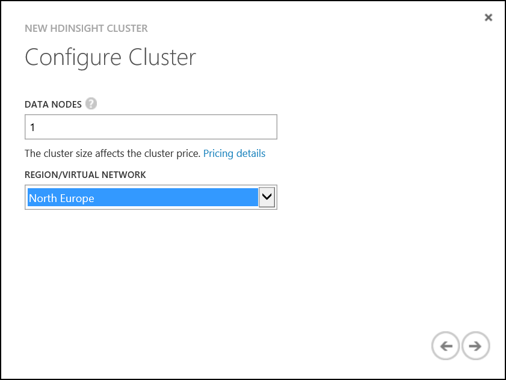
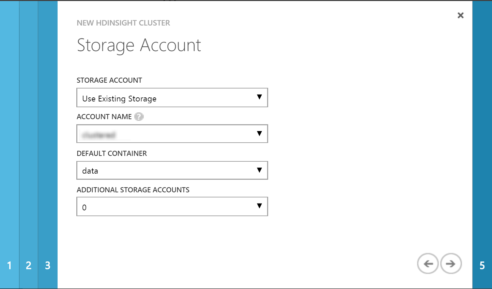
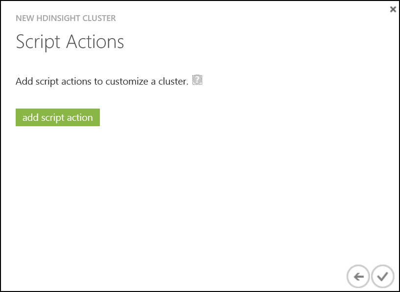
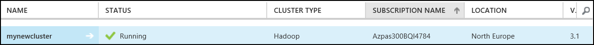
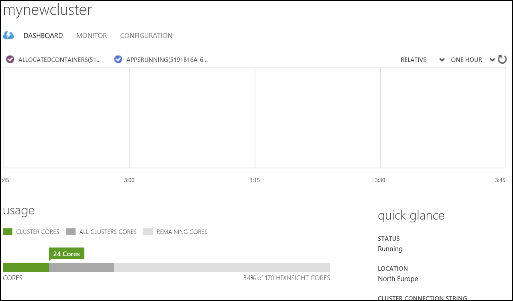
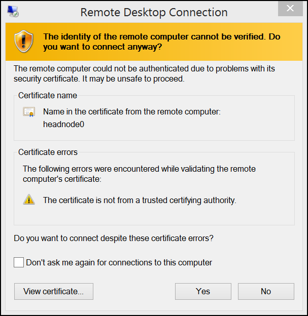
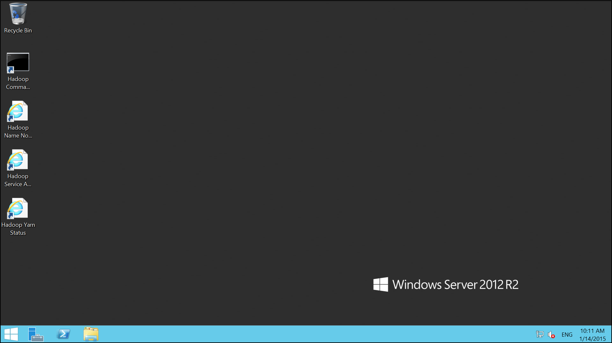

# Hands on Lab 2 - Introduction to HDInsight #

Overall time to complete: **25 minutes**

Prerequisites: **Azure Storage Account Creation in Hands on Lab 1**

# 1 HDInsight Cluster Overview #

Azure HDInsight deploys and provisions Apache Hadoop clusters in the cloud, providing a software framework designed to manage, analyze, and report on big data. 

The Hadoop core provides reliable data storage with the Hadoop Distributed File System (HDFS), and a simple MapReduce programming model to process and analyze, in parallel, the data stored in this distributed system.

## 1.2 Create the HDInsight cluster ##

1. 	Navigate to the Microsoft Azure management interface [https://manage.windowsazure.com](https://manage.windowsazure.com) (NOTE: HDInsight clusters are only configurable in current Management Portal at this time)

2. 	Ensure you are on the correct subscription by locating the subscriptions button in the upper right hand corner of the page.

	

3. 	Navigate to "HDInsight" tab on the left hand menu.

	

4. 	Click "+NEW" in the bottom left hand corner of the page.

	

5. 	This will open up the data services menu and highlight HDInsight (note the path Data Service -> HDInsight).

	

6. 	Click on the "Custom Create" button.

	

7. 	A New HDInsight Cluster creation wizard will open.  
	- Enter a name for the cluster; if available the interface will indicate with a green tick. 
	- Note the options for Cluster Type and HDInsight Version. Don't change any of the default settings, this will be Hadoop and version 3.1. 
	
	Click the "Next" arrow in the lower right corner.

	

8. 	Change Data Nodes to **1** to create a 1 node cluster.  Select the Location to the same location specified when you created the storage account in HOL1.  Click the "Next" arrow in the lower right corner.

	

9. 	An administrative user is created for access via the web browser in later exersizes.  
	- Enter a username and password.  You may want to store the username and password in a text document on the desktop for use later in the lab. 
	- Notice the option to enter the Hive/Oozie Metastore.  Many production clusters will use a centralized Azure SQL Database to store Hive metadata, creating an agile method for bursting clusters on-demand, and reusing metadata across clusters over time.  Our labs will not use a centralized metastore, do not check the option.  
	
	Click "Next".  

	

10. Note the options under STORAGE ACCOUNT to use an existing storage account or create a new account.  We will use the storage account created in Hand On Lab 1.  
	- Select **Use Existing Storage**.  
	- Change the ACCOUNT NAME drop-down to the name of the Storage Account that was created in HOL1. 
	- Select the container **data** we created in HOL1.  
	- ADDITIONAL STORAGE ACCOUNTS specifies the number of additional storage accounts for use with the cluster.  Our labs only require the single storage account, accept the default.  
	
	Click "Next".

	

11.	The final view **Script Actions" will add PowerShell script that can be run during the provisioning process.  This is useful for installing additional software or features on the cluster.  Microsoft has release several examples like R, Solr, and Spark.  Our labs will not require additinal software or features.  

	Click the check mark in the lower right-hand corner to finish and create the cluster.  

	

12.	The provisioning process completes in 10-20 minutes. The HDInsight cluster and the cluster status will be visible in the list of available clusters.

	

# 2. Enable Remote Desktop #

Some administrators may want to manage the cluster from the head node.  HDInsight supports RDP to the head node, which is enabled through the portal, through PowerShell or the command line.  The following steps will enable RDP through the management portal.

1. 	Navigate to the Microsoft Azure management interface [https://manage.windowsazure.com] (NOTE: RDP can only be configured through the management interface at this time)
 
2. 	Select HDInsight from the left menu and click on the cluster you just created.  The quick start screen will be presented. Here you can select the **Dashboard** from the top menu to view general information on the cluster.

	

3. 	Select **configuration** from the top menu.

	

4. Select **Enable Remote** from the bottom of the page.

	

5. 	RDP will require a new username unique to the cluster. 
	- Enter a new username and password.  **The username must differ from the admin user chosen at cluster creation.** 
	- Select an expiration date for RDP.  NOTE: The expiration date must be in the future and no more than a week from the present. The expiration time of day is assumed by default to be midnight of the specified date. 
	
	Click Ok to configure RDP, this will take 2-3 minutes to complete.

	

# 3. Connecting to the HDInsight cluster ####

1. 	Once configuration is complete you can initiate the RDP connection using the Connection button located at the bottom of the screen.  A open/save dialog will appear at the bottom of the page. Select Open.

	
	
2. 	A new dialog will open, Click Connect.

	

3. 	Enter your credentials, use the credentials specified as part of the Remote Desktop configuration in the previous step (5) when connecting to the instance. 

	

4. 	Choose yes to accept the certificate.

	

5. 	You will then be presented with the a remote desktop connection for the head node of the cluster.

	

## 3.1 Using the Hadoop Filing System ####

1. 	Once logged in open the Hadoop Command Line. The link to this can be found on the desktop of the head node.

	

2. 	Execute the command 

	`hadoop fs -ls /`

3. 	The following set of files will be displayed

	

4. 	A number of directories will have been created as part of the cluster provisioning process.  These directories should remain untouched so the cluster can operate normally.
 
	* HdiSamples
		* Contains a set of sample data
	* apps
		* Contains 3rd party apps that are required for the normal operation of the cluster
	* example
		* Additional examples and data
	* hive
		* Where the hive tables are stored
	* mapred
		* Contains the history of map reduce jobs
	* user
		* A set of libraries associated with the hadoop user
	* yarn
		* Holds the yarn application history data
