# HDI Batch Analysis and PowerBI #

Overall time to complete: **30 minutes**

Prerequisites: **Azure Storage Account Creation in Hands on Lab 1**, **HDInsight Cluster Creation in Hands on Lab 2**

At the end of this lab you should have achieved: 

- The creation of HIVE tables 
- Data transformation using HIVE 
- PowerBI visualization showing IoT device data

# 1. Overview #

This lab will demonstrate batch analysis with aggregation on a data set.  Performing simple sums, counts and averages of data using HIVE. The data will be displayed through a simply generated Power Dashboard on the web.


# 2. Introduction to Hive #

The Apache Hive data warehouse software facilitates querying and managing large datasets residing in distributed storage. Hive provides a mechanism to project structure onto this data and query the data using a SQL-like language called HiveQL.  The query is executed as a MapReduce job on a HDInsight cluster.

In the "Hands on Lab 1" we uploaded a dataset to our HDInsight container using azcopy. In this lab we'll consume this dataset. The data is device data from  "Smart Home" sensors which contain everything from temperature to light intensity metrics.

# 3. Using the Hive web interface #

The HDInsight cluster provides a web based interface to execute Hive queries.  

1. 	Return to the HDInsight cluster in the Azure Management Portal and click on the "Query Console" button at the bottom of the screen.

	 

2. 	Enter the credentials you initially used when creating the HDInsight cluster when presented with the login dialog. 

	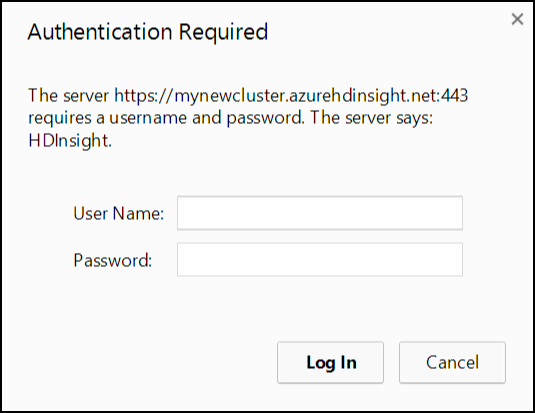 

3. 	The **Getting Started Gallery** will be displayed. Several samples and common solutions are available from the gallery. 

	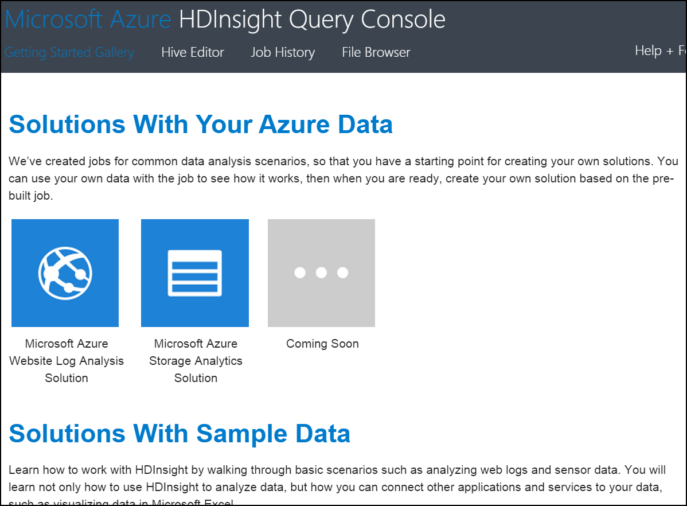

4. 	Click on the Hive Editor link at the top of the screen.  Note that a sample query is loaded into the query editor.  

	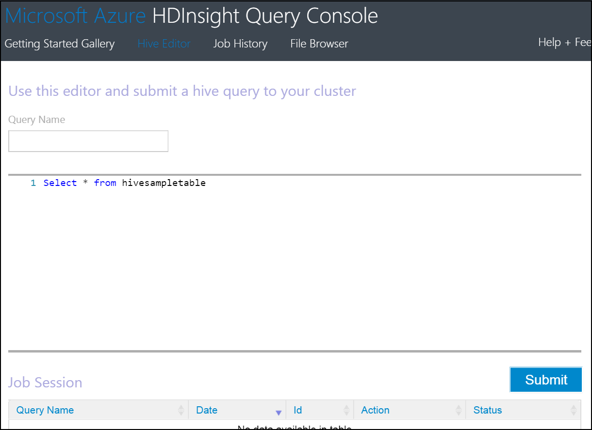


# 4. Building HIVE Queries #

Hive supports both INTERNAL and EXTERNAL tables.  
- Use the CREATE EXTERNAL TABLE command to create the table without moving the raw data.  The raw data is not affected by any operation, including a DROP TABLE or when you drop the Hadoop cluster.  
- The CREATE TABLE statement will create an internally managed table.  When you drop this table, the data is also deleted.  

Hive processes may include using intermediate tables to transform data.  These tables typically do not need to persist when you drop the cluster.  These intermediate tables are best suited for internally managed tables.  Final processed data is best suited for EXTERNAL tables. This will provide  the benefit of dropping a cluster without losing the processed data.  


## 4.1 Creating the HIVE source table ##

The following steps will associate the source data loaded Azure Blob Storage with a Hive table. 

1.	Copy the following hive query into the editor window to create an EXTERNAL table over the data loaded in Hands on Lab 1.  A copy of this statement is stored on the course virtual machine at **C:\CloudDataCamp\Scripts\Hive\1_CreateDeviceReadings.txt**. 
	
	Note that in this case the data file is loaded prior to the schema. This demonstrates the "schema on read" nature of Hive, which means the schema defined in the CREATE TABLE statement is applied when a SELECT statement is issued on the table.

	```SQL
	DROP TABLE IF EXISTS DeviceReadings;

	CREATE EXTERNAL TABLE DeviceReadings (
		type string, sensorDateTime string, deviceId string, roomNumber int, reading float
	)
	ROW FORMAT DELIMITED FIELDS TERMINATED BY '\054'
        STORED AS TEXTFILE
        LOCATION 'wasb://data@<storage account name>.blob.core.windows.net/input';
	```

	n.b. Update the last line in query and replace <storage account name> with the storage account you created in Hands on Lab 1.

2. 	Click the Submit button to execute the query.

 	

3. 	After a short delay a new Job will appear in the Job Session section with a status of Running.

 	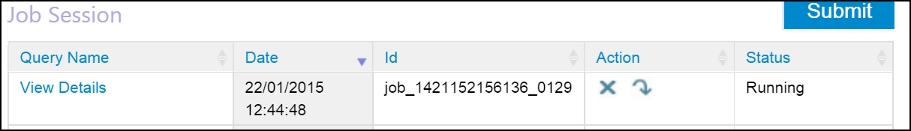

4.	Wait for the job to complete.

 	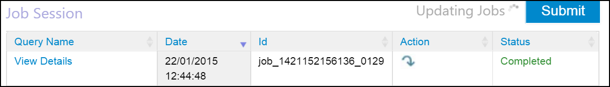

5.	Replace the text in the Hive editor window with the following to validate the table was created and the data was loaded correctly.
	
	```SQL
	SELECT deviceId FROM DeviceReadings;
	```

When the query completes, click on "View Details" in the Job Session.  The Job Output should list the deviceId values in the data.csv file. 

NOTE: Typically data is captured by calendar day, so, the input folder would be organised as input/yyyy/MM/dd.  The table creation script above would then be modified to include a partition strategy for new input folders.
	
	```SQL
	PARTITIONED BY (year string, month string, day string)
	```

## 4.2 Average reading by device type query ##

1.	Copy the following query and replace the text in the editor window to create a table for aggregated data and insert data from the previously created DeviceReadings table.  A copy of this statement is stored on the course virtual machine at **C:\CloudDataCamp\Scripts\Hive\2_CreateAverageReadingByType.txt**. 

	It is common in Hadoop batch processing to iterate through data processing of source data and store denormalized data.

	```SQL
	DROP TABLE IF EXISTS AverageReadingByType;

	CREATE EXTERNAL TABLE AverageReadingByType (type string, reading float)
        row format delimited 
        fields terminated by '\t' 
        lines terminated by '\n' 
        stored as textfile location 'wasb://data@<storage account name>.blob.core.windows.net/output/averageReadingByType';


	INSERT INTO TABLE AverageReadingByType SELECT TYPE, avg(reading) 
	    FROM DeviceReadings  
		GROUP BY TYPE;
	```

	n.b. Update the last line in the CREATE TABLE query and replace <storage account name> with the storage account you created in Hands on Lab 1.

2.	Click the Submit button to execute the query and wait for the job to complete.

3.	After the job has completed, click File Explorer from the top menu of HDInsight Query Console.

4.	To view the files generated with the previous Hive statement, click through the following path:
	**\<storage account name> > data > output > averageReadingByType**.   

5.	Click on the file with a numeric name and select **Save** when prompted.  **Open** the file using Notepad.  Review the output.


## 4.3 Average reading by minute query ##

1.	Return to the Hive Editor.  Copy the following query to the editor window to aggregate an average reading by minute.  A copy of this statement is stored on the course virtual machine at **C:\CloudDataCamp\Scripts\Hive\3_CreateAverageReadingByMinute.txt**. 

	```SQL
	DROP TABLE IF EXISTS AverageReadingByMinute;

	CREATE EXTERNAL TABLE AverageReadingByMinute (type string, sensorDateTime string, roomNumber int, reading float)
       row format delimited 
       fields terminated by '\t' 
       lines terminated by '\n' 
       stored as textfile location 'wasb://data@<storage account name>.blob.core.windows.net/output/averageReadingByMinute';

    INSERT INTO TABLE AverageReadingByMinute SELECT TYPE,  concat(substr(sensorDateTime, 1, 16), ":00.0000000Z"), roomNumber, avg(reading) 
       FROM DeviceReadings 
       WHERE roomNumber IS NOT NULL 
       GROUP BY TYPE, concat(substr(sensorDateTime, 1, 16), ":00.0000000Z"), roomNumber;
	```
	
	n.b. Update the last line in the CREATE TABLE query and replace <storage account name> with the storage account you created in Hands on Lab 1.

2. 	Click the Submit button to execute the query and wait for the job to complete.


## 4.4 Maximum device reading ##

1. 	Copy the following query to the editor window to create a table with maximum device values.  A copy of this statement is stored on the course virtual machine at **C:\CloudDataCamp\Scripts\Hive\4_CreateMaximumReading.txt**. 

	```SQL
	DROP TABLE IF EXISTS MaximumReading;

	CREATE EXTERNAL TABLE MaximumReading (type string, sensorDateTime string, roomNumber int, maxReading float)
       row format delimited 
       fields terminated by '\t' 
       lines terminated by '\n' 
       stored as textfile location 'wasb://data@<storage account name>.blob.core.windows.net/output/maximumReading';

    INSERT INTO TABLE MaximumReading 
    SELECT mr.type, min(mr.sensorDateTime), min(mr.roomNumber), mr.reading FROM (
	   SELECT a.type, a.sensorDateTime, a.roomNumber, a.reading from DeviceReadings a
	   JOIN (SELECT type, max(reading) reading FROM DeviceReadings GROUP BY type ) b
	   ON (a.type = b.type and a.reading = b.reading) 
    ) mr 
    GROUP BY mr.type, mr.reading;
	```
	
	n.b. Update the last line in the CREATE TABLE query and replace <storage account name> with the storage account you created in Hands on Lab 1.

2. 	Click the Submit button to execute the query and wait for the job to complete.


## 4.5 Minumum device reading ##

1. 	Copy the following query to the editor window to create a table to store minumum device reading values.  A copy of this statement is stored on the course virtual machine at **C:\CloudDataCamp\Scripts\Hive\5_CreateMinimumReading.txt**.   

    ```SQL
    DROP TABLE IF EXISTS MinimumReading;
    
    CREATE EXTERNAL TABLE MinimumReading (type string, sensorDateTime string, roomNumber int, maxReading float)
	    row format delimited 
        fields terminated by '\t' 
        lines terminated by '\n' 
        stored as textfile location 'wasb://data@<storage account name>.blob.core.windows.net/output/minimumReading';
    
    INSERT INTO TABLE MinimumReading 
    SELECT mr.type, min(mr.sensorDateTime), min(mr.roomNumber), mr.reading FROM (
        SELECT a.type, a.sensorDateTime, a.roomNumber, a.reading from DeviceReadings a
        JOIN (SELECT type, min(reading) reading FROM DeviceReadings GROUP BY type ) b
        ON (a.type = b.type and a.reading = b.reading) 
    ) mr 
    GROUP BY mr.type,  mr.reading;
    ```
    
	n.b. Update the last line in the CREATE TABLE query and replace <storage account name> with the storage account you created in Hands on Lab 1.

2. 	Click the Submit button to execute the query and wait for the job to complete.

3. 	Close the Hive Editor.


# 5. Drop the Cluster #

The nature of HDInsight allows you to create clusters on demand, and only pay for the time needed to process data.  Once we completed the above steps, the HDInsight cluster may be dropped.  Data in the storage accounts will still be available for analysis, as demonstrated later in the lab. 

1.	Return to the HDInsight cluster in the Azure Management Portal.

2.	Click **Delete** at the bottom of the console.  Click **Yes** when prompted to verify the delete action.


At the end of this section you will have created five new Hive tables, and output data to the storage account.  The next sections will demonstrate using Microsoft Power BI to connect to the data, shape the data, and create visualizations. 

# 6. HDInsight Integration with Microsoft Power BI through PowerQuery #

Those who depend on data often use Excel to shape, filter and organize data.  Power Query is now available as an add-in with Excel to provide a visual environment to build repeatable data shaping processes.  In many ways, this can be considered "Self-Service ETL" with a strength in shaping data through a familiar Excel interface. 

With Power Query you can: 
- Identify and shape the data you care about from the sources you work with (e.g. relational databases, Excel, text and XML files, OData feeds, web pages, Hadoop HDFS, etc.).
- Discover relevant data using the search capabilities within Excel.
- Combine data from multiple, disparate data sources and shape it in order to prepare the data for further analysis in tools like Excel and PowerPivot.

The following section will introduce a simple scenario of connecting to a Hadoop data source in HDInsight.  This section will require the name of your blob storage account and the key associated with the account.  

1.	Open Excel from the desktop taskbar.  Create a new blank workbook.

2.	Select the **Power Query** tab located at the top of the Excel workbook. 

3.	Note the various options in the ribbon.  Select the **"From Azure"** dropdown select **"From Microsoft Azure HDInsight"** option.

4.	Enter the name of your **blob storage account** associated with the HDInsight cluster.  

 	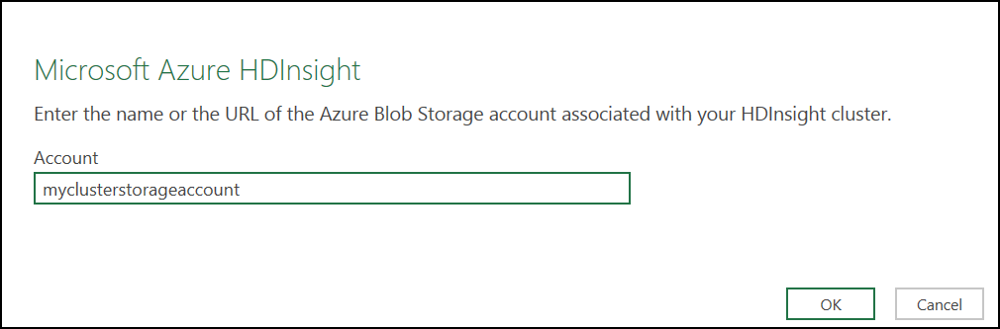

5.	Enter your storage account key which should be saved to the desktop via notepad (from Hands on Lab 1) and click **Save**.

 	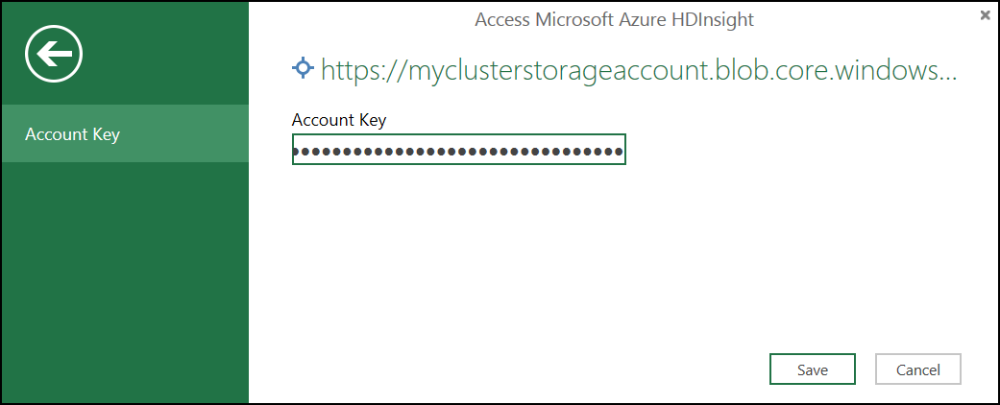 

6.	The Navigator pane is displayed to the right of the workbook.  Double click the **data** container name.

 	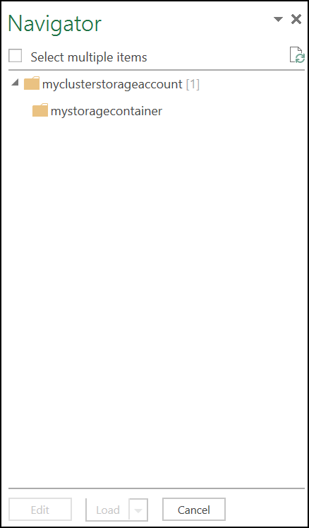 
 
7.	The Query Editor window will be load. The blob files in the storage container are displayed. 

 	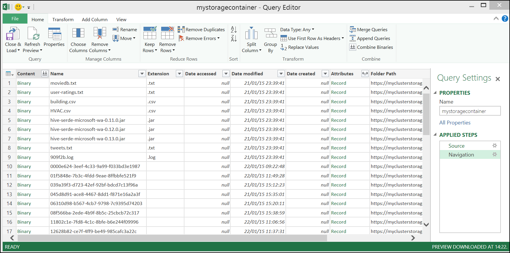 

8.	To extract the data from the HDInsight job we need to find the reference the output from our HIVE jobs.  Click on the  on the "Folder Path" column at the far right of the Query Editor window.  Enter averageReadingByMinute in the text filter box. 

 	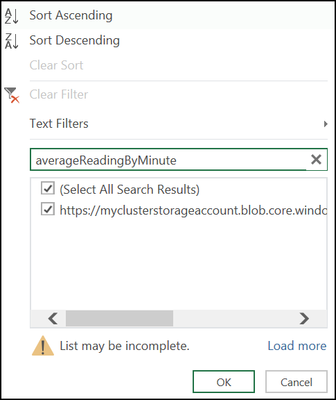 

9.	The content of the previous window will be updated.

 	  

10.	Select the  link in the first column to import the csv.

 	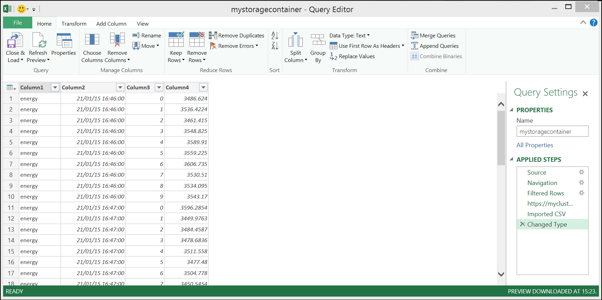

11.	Notice the options in the Query Editor ribbon.  Power Query supports simple activites like adding and removing columns, and more advanced options like replacing values, aggregating columns, and pivoting/unpivoting data.

12.	Rename columns the columns with the following names.  Double-click each column header to rename.	

	- DeviceType
	- ReadingDateTime
	- RoomNumber
	- Reading

 	
 
13.	Click **Close & Load** from the Home ribbon.  A new sheet will be created (AverageReadingByMinute) in the workbook.

 	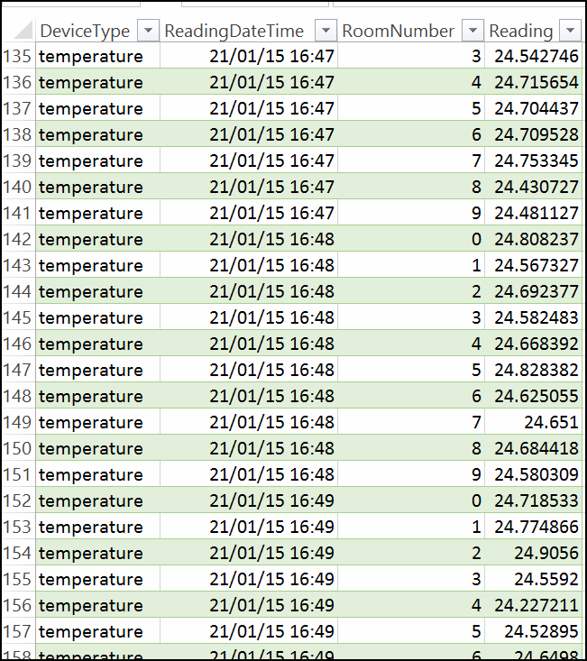

14. Save the workbook to the desktop.  


# 7. Visualizing the HIVE output with Microsoft Power BI through Power View #

In this lab you will explore the visualization capabilities of Power View. 

Power View is an Excel and web-based data exploration and report authoring tool that enables everyone to create compelling, interactive, and rich data visualizations.   

1. 	Return to the Excel workbook created in the previous section.  Select the Insert tab and choose option   

 	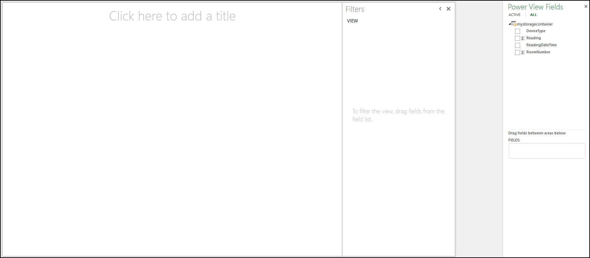
 
2.	To create a graphical representation of the data we can create a new table. Note the **"Power View Fields"** pane on the right hand side which has pre-selected all the fields from the Power Query table result of the previous section.

 	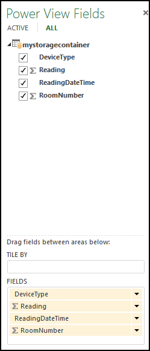 

3.	From the lower section of the Power Fiew Fields pane, select the    for   and change to “Do no summarize”

4.	The large pane beneath the ribbon is the report designer. This is a work space that supports an interactive design and data exploration experience.

 	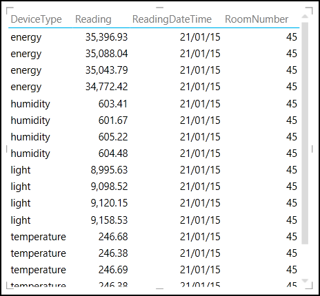 
 
5.	Select the table in the report designer pane.  At the top Design ribbon, click  and select **"Line"**.  The following graphical representation of the data will be displayed.

 	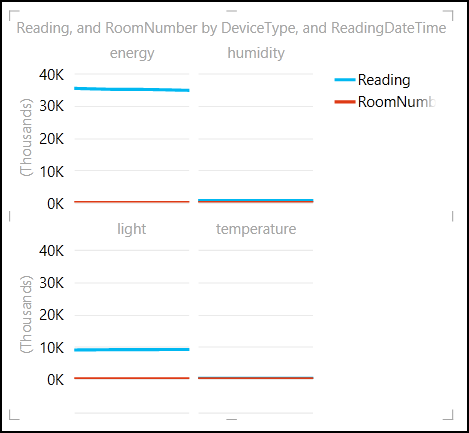  

6.	The Filters tab is to the right of the designer pane. Select Chart and note the field values. Expand **DeviceType** and check **energy**.

 	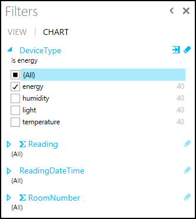  

7. 	Click the text "Click here to add a title" at the top of the report designer and add a title.  

 	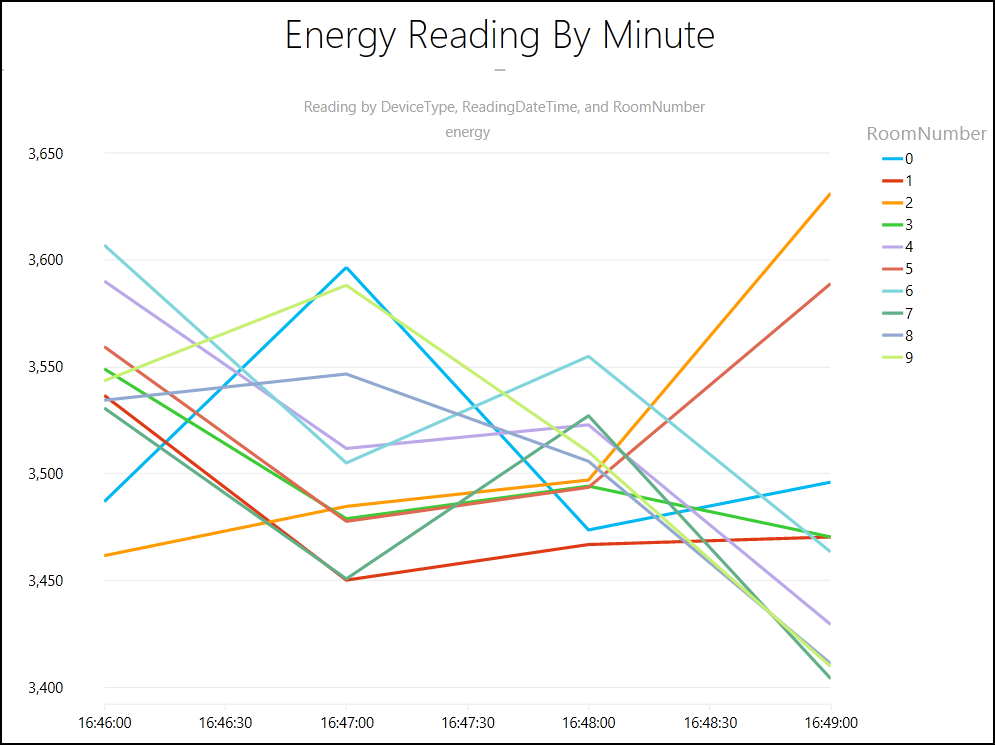   


# 8. Using Microsoft Power BI Online (Optional if you have Office 365 and Sharepoint access) #

With the Power BI sites application, you can transform your SharePoint Online site into a more robust, dynamic location to share and find Excel reports, with a visual, interactive view tailored to BI.

The Power BI sites app is available when you register for Power BI for Office 365. You can apply it to a new or an existing site in SharePoint Online Enterprise. 

1. 	Navigate to your Office 365/SharePoint site and click documents in the right hand menu.

 	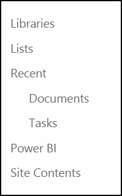 

2. 	Click upload and choose the file, click OK.

 	 

3. 	Once uploaded the document will show in the list of available documents.

 	

4. 	Select Power BI from the right hand menu, locate the document.
 
 	 

 	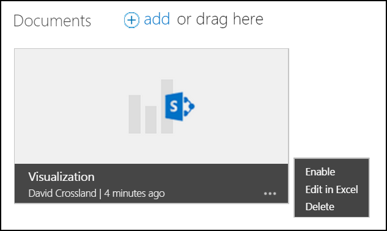

5. 	Select Enable.

 	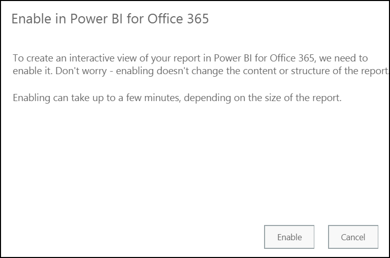

6. 	Click Close.

 	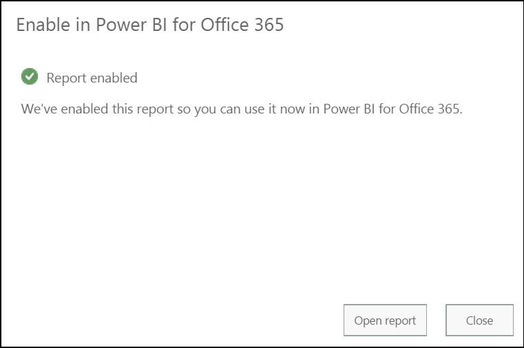

7. 	Click  and choose **"Add to Featured Reports"**.

 	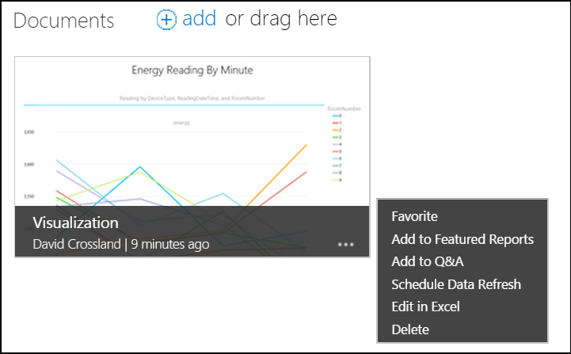

8. 	The report will now be available on the dashboard.

 	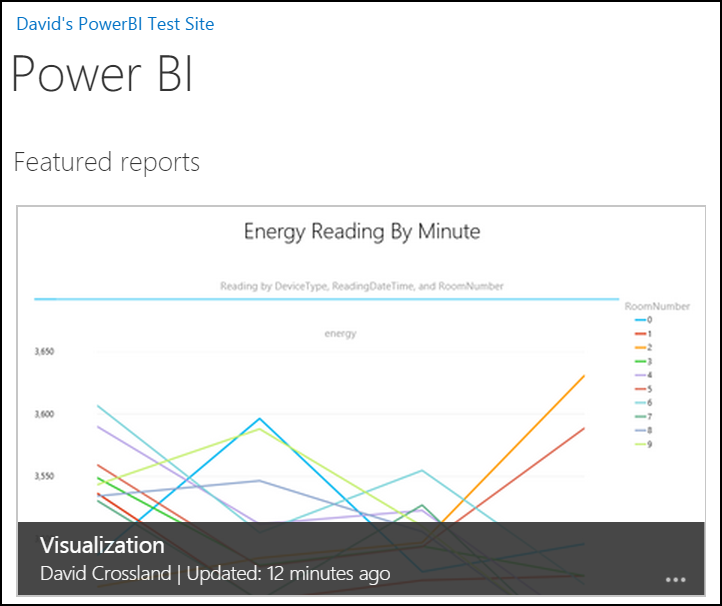
